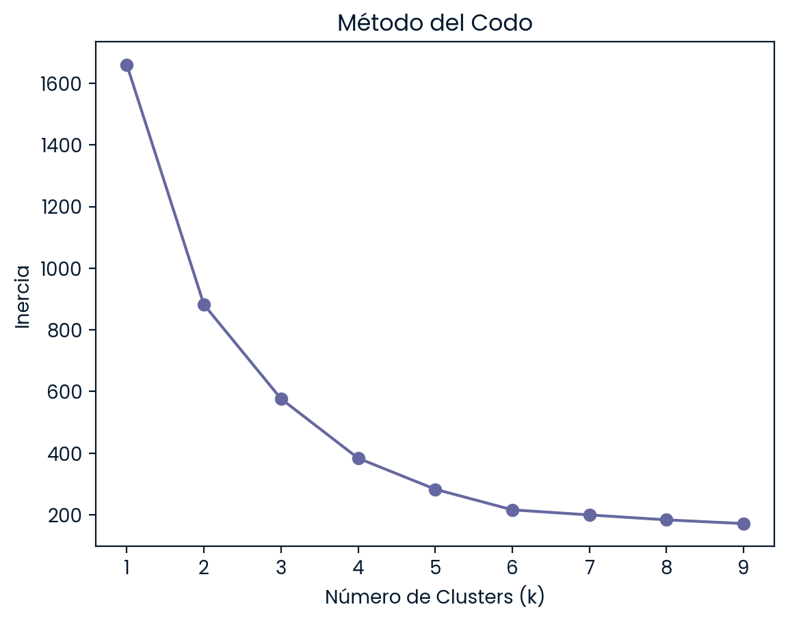
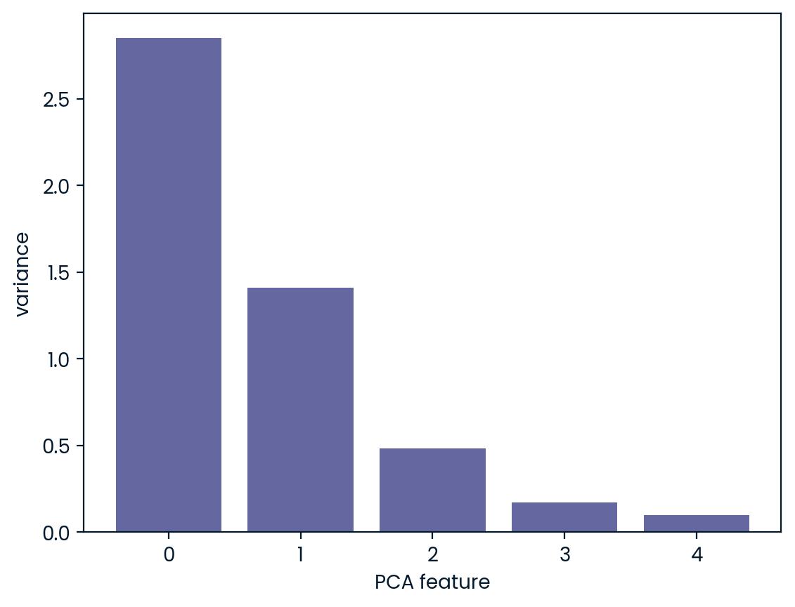

# Agrupación de Especies de Pingüinos de la Antártida con Aprendizaje No Supervisado (K-Means & PCA)

El objetivo de este proyecto es agrupar y clasificar especímenes de pingüinos de Palmer mediante **K-Means y PCA (Análisis de Componentes Principales)** a partir de sus dimensiones físicas y sexo. El estudio busca comprender la **estructura natural de los datos morfológicos**, identificar patrones de **dimorfismo sexual** e interpretar cómo se relacionan las características físicas sin requerir etiquetas previas.

---

### Herramientas y tipo de proyecto

  
  
  
  
  
  
  
  
  
  
  

---

### Preguntas clave
1. ¿Cuál es la cantidad óptima de clusters ($k$) para agrupar los datos morfológicos y de sexo de los pingüinos?
2. ¿Cómo se distribuyen los promedios morfológicos de cada variable en las agrupaciones identificadas?
3. ¿Qué porcentaje de la varianza total del conjunto de datos retienen las componentes principales?
4. ¿Permiten las componentes principales proyectar los datos en 2D con una clara separación entre clusters y centroides?

---

### Metodología
* **Preprocesamiento de datos:** Análisis exploratorio de los 332 registros limpios del archivo `penguins.csv` y conversión de la variable categórica `sex` mediante *One-Hot Encoding* (`sex_MALE`).
* **Estandarización de características:** Escalado de variables cuantitativas con `StandardScaler` para equilibrar el peso de las magnitudes físicas (como la masa corporal en gramos frente al pico en milímetros).
* **Determinación de clusters ($k$ óptimo):** Evaluación de la inercia mediante el **Método del Codo (*Elbow Method*)** para valores de $k$ entre 1 y 9, identificando el punto de inflexión significativo en $k = 4$.
* **Modelado No Supervisado:** Entrenamiento del algoritmo K-Means ($k = 4$, `random_state = 42`), asignación de etiquetas y cálculo de la tabla resumen de promedios (`stat_penguins`).
* **Reducción de dimensionalidad y visualización:** Aplicación de PCA (`n_components = 2`) sobre los datos escalados para proyectar el espacio multidimensional en un plano 2D y ubicar la posición de los centroides.

---

### Conclusiones y recomendaciones

#### Caracterización por cluster ($k = 4$):
* **Segmentación morfológica precisa:** El modelo identificó $k = 4$ grupos clave diferenciados por tamaño general y sexo:
  * **Cluster 0:** Especie pequeña/mediana machos (pico corto pero profundo: $43.88\text{ mm}$ largo / $19.11\text{ mm}$ profundidad, masa: $4,006.60\text{ g}$).
  * **Cluster 1:** Especie grande hembras (pico delgado: $45.56\text{ mm}$ largo / $14.24\text{ mm}$ profundidad, aletas largas: $212.71\text{ mm}$, masa: $4,679.74\text{ g}$).
  * **Cluster 2:** Especie pequeña hembras (pico más corto y menor tamaño general: $40.22\text{ mm}$ largo, masa: $3,419.16\text{ g}$).
  * **Cluster 3:** Especie grande machos (los especímenes de mayor tamaño y masa corporal: $221.54\text{ mm}$ aleta, masa: $5,484.84\text{ g}$).

#### Relevancia biológica y analítica:
* **Segmentación biológica natural:** Sin requerir etiquetas previas, K-Means logró separar de forma automática la variabilidad morfológica entre especies y el dimorfismo sexual interno (machos vs. hembras).
* **Conservación de varianza con PCA:** La proyección en 2D retiene más del **80% de la varianza total** del dataset, mostrando cuatro agrupaciones aisladas entre sí con sus centroides correctamente posicionados.

---

### Visualizaciones destacadas

1. **Método del Codo para $k$ óptimo:** Determinación de $k = 4$ mediante la inercia del modelo.

  

2. **Varianza explicada por Componentes Principales:**

  

> *La primera componente principal (PC1) explica la mayor proporción de la variabilidad, y en conjunto con PC2 capturan más del 80% de la varianza total del dataset.*

3. **Proyección 2D con PCA y Centroides:** Visualización de los cuatro clusters formados y la ubicación de sus centroides.

  

> *La proyección 2D confirma cuatro agrupaciones compactas y aisladas entre sí, con los centroides ($X$ rojas) perfectamente posicionados en el centro de densidad de cada grupo.*

---

### Diccionario de datos

**Origen de los datos:** Los datos fueron recopilados y puestos a disposición por la Dra. Kristen Gorman y la *Palmer Station, Antarctica LTER*, miembro de la *Long Term Ecological Research Network*.

El conjunto de datos consta de **5 columnas** que describen las medidas físicas de los pingüinos:

| Columna | Descripción |
| --- | --- |
| `culmen_length_mm` | Longitud del culmen/pico (mm). |
| `culmen_depth_mm` | Profundidad del culmen/pico (mm). |
| `flipper_length_mm` | Longitud de la aleta (mm). |
| `body_mass_g` | Masa corporal total (g). |
| `sex` | Sexo del espécimen (`MALE` / `FEMALE`). |
